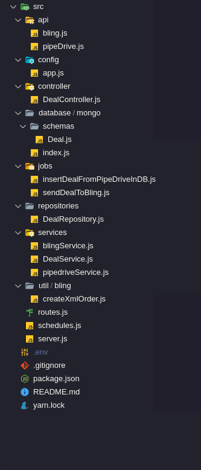

# Desafio técnico LinkApi - Backend Nodejs

## ***Descrição do desafio implementado***.
 O presente desafio foi implementado da seguinte maneira: Foi criado dois Jobs que a cada determinado intervalo de tempo (atualmente está definido o intervalo de 1 min para questões de testes) irão consultar e enviar os dados dos negócios. O primeiro job criado foi o **insertDealFromPipeDriveInDB**, o mesmo consulta o serviço da PipeDrive e retorna os novos negócios que foram criado e que estão com status "ganho". Depois de retornado essas informações, o job salva-as no banco de dados (MongoDB) com os seguintes campos:

```json
{
        "title": "String",
        "owern_name": "String",
        "value": "Number",
        "currency": "String",
        "won_time": "String",
        "status": "String",
        "date": "String",
        "bling_send": "Boolean"
}
```

 Depois de salva essas informações no Banco de Dados, outro job **sendDealToBling** busca na base de dados os negócios que ainda não foram enviado para o serviço da Bling e os envia. Depois de enviado, o job muda o status do campo (bling_send) para true na base,(o padrão é false, e indica que ainda não foi enviado) informando que ela já foi enviada. Por final foi criado dois endpoints para consultar as informações salvas na base de dados.

## Estrutura de pasta do projeto



## ***Endpoints REST para consulta das informações***.

* /reports - Retornar as oportunidades inserida agregada por data e valor.
  ```json
    [
        {
            "totalValue": 35000,
            "qtd": 2,
            "date": "08/02/2021"
        },
        {
            "totalValue": 80000,
            "qtd": 2,
            "date": "07/02/2021"
        }
    ]
  
  ```
* /deals - Retorna as oportunidades salvos na base de dados.
     ```json
    [
        {
            "bling_send": true,
            "_id": "60212c71a8d9ab675f1be59e",
            "cod": 3,
            "title": "Negócio Tester Inovations",
            "owern_name": "Usuario de teste",
            "value": 30000,
            "currency": "BRL",
            "won_time": "2021-02-05 16:47:05",
            "date": "07/02/2021",
            "__v": 0,
            "createdAt": "2021-02-08T12:20:01.108Z",
            "updatedAt": "2021-02-08T12:21:03.657Z"
        },
    ]
  
  ```

_____________________________________________

## Executar na raiz do projeto

  >  `yarn start` 
  
_____________________________________________

## variáveis [(.env)](.env)

1. Mongo *variaveis de conexão*
    * MONGO_URL=

2. pipeDrive *Credenciais e URL da api*
    * MY_COMPANY_DOMAIN=
    * PIPE_DRIVE_PERSONAL_TOKEN=

3. Bling *Credenciais e URL da api*
    * BLING_URL=
    * BLING_API_KEY=
